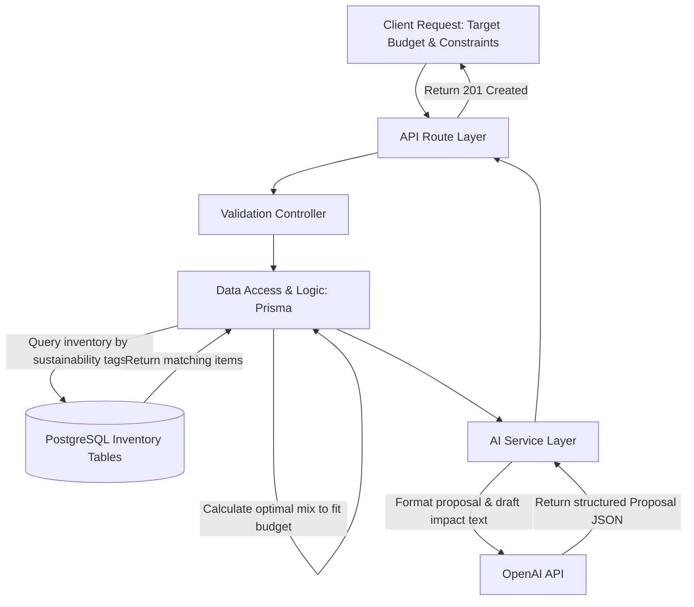

# Module 2 Architecture: AI B2B Proposal Generator

The AI B2B Proposal Generator automates the creation of professional, sustainable product proposals for wholesale clients. Instead of manually combing through inventory and calculating margins, this module uses business logic to select products that fit the client's budget and constraints, and then leverages the LLM to format the proposal and write compelling impact statements.

## Architectural Layers

### 1. API Route Layer (`src/routes/proposalRoutes.ts`)

- **Purpose:** Entry point for B2B proposal requests from the frontend or CRM system.
- **Functionality:** Exposes endpoints like `POST /api/proposals/generate`. It accepts the client's requirements (e.g., Target Budget, Industry, Preferred Materials).

### 2. Controller & Validation Layer (`src/controllers/proposalController.ts`)

- **Purpose:** Validates incoming payloads and orchestrates the proposal generation process.
- **Functionality:**
  - Ensures the budget is a valid number and required fields are present.
  - Calls the Data Access layer to fetch inventory.
  - Reassembles the data to pass to the AI Service.
  - Sends the final generated proposal back to the client as a 201 Created response.

### 3. Data Access & Logic Layer (Prisma)

- **Purpose:** Queries the database for products matching the requirements using strict business rules.
- **Why we don't let AI do this:** AI is bad at precise math and database querying. We use pure TypeScript logic to:
  1. Fetch all `Product` records tagged with the client's preferred sustainability tags (e.g., `plastic-free`).
  2. Iterate through the products and calculate a "Suggested Mix" until the total wholesale cost reaches, but does not exceed, the `Target Budget`.
  3. Calculate the exact cost breakdown (Subtotal, Shipping, Taxes).

### 4. AI Service Layer (`src/services/aiService.ts`)

- **Purpose:** Formats the purely mathematical data into a persuasive, human-readable sales document.
- **Functionality:**
  - Takes the "Suggested Mix" constructed by our backend logic.
  - System prompt instructs the LLM to act as a B2B Sustainability Sales Expert.
  - The LLM outputs a structured JSON object containing:
    - An executive summary.
    - A nicely formatted table/list of the recommended products.
    - An `impactPositioningSummary` (e.g., "By purchasing this lot, your hotel will avoid using 500 single-use plastics this quarter...").

### 5. Database Layer (PostgreSQL)

- **Purpose:** Stores the finalized proposals for future reference or CRM tracking.
- **New Tables Required:**
  - `B2BProposal`: Stores `clientId`, `budget`, `finalCost`, `proposalJson` (the AI's output), and `status` (Draft, Sent, Accepted).

## Architecture Flow Diagram

