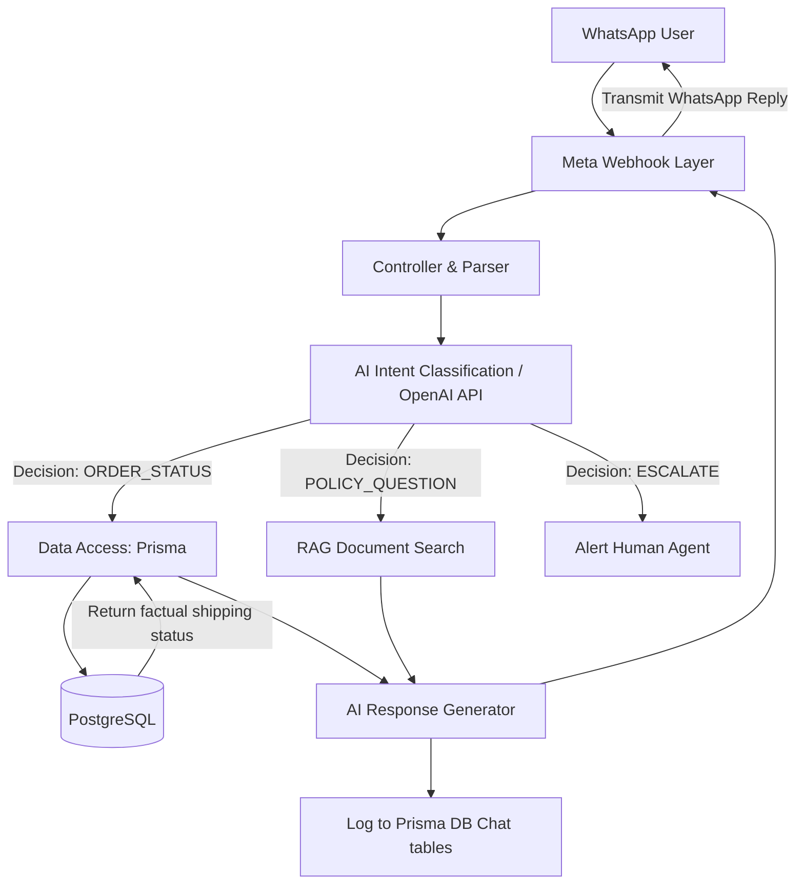

# Module 4 Architecture: AI WhatsApp Support Bot

The AI WhatsApp Support Bot acts as a Level 1 customer support agent. It directly interfaces with the Meta WhatsApp Business API to answer customer queries regarding order statuses and return policies, intelligently escalating complex issues to human agents.

## Architectural Layers

### 1. Webhook Route Layer (`src/routes/webhookRoutes.ts`)

- **Purpose:** Receives incoming messages in real-time directly from WhatsApp.
- **Functionality:** Exposes a `POST /api/webhooks/whatsapp` endpoint. Must handle Meta's authentication tokens to verify the request is genuinely from WhatsApp.

### 2. Controller & Webhook Handler (`src/controllers/whatsappController.ts`)

- **Purpose:** Parses the incoming WhatsApp payload (phone number, message text, timestamps).
- **Functionality:**
  - Extracts the user's message.
  - Routes the text to the Intent Classification layer.
  - Uses the Meta Graph API to send the final generated text back to the customer's WhatsApp number.

### 3. Intent Classification Layer (AI Service)

- **Purpose:** Determines the user's goal before taking action to save processing time and ensure accuracy.
- **Functionality:** Passes the user's message to the LLM with a strict prompt: _Classify this text as one of: [ORDER_STATUS, POLICY_QUESTION, ESCALATE, CHAT]_
  - **ORDER_STATUS:** Proceeds to Data Access layer to fetch shipping details.
  - **POLICY_QUESTION:** Uses RAG (Retrieval-Augmented Generation) to search the Return Policy document.
  - **ESCALATE:** Triggers alerting in the system and notifies a human agent.

### 4. Data Access & Business Logic Layer (Prisma)

- **Purpose:** Retrieves factual data to ensure the AI does not hallucinate (make up) order details.
- **Functionality:** If the intent was classified as `ORDER_STATUS`, the backend requires the user to provide an Order Number. It then queries the `Order` table in PostgreSQL. The real-time status (e.g., "Shipped via FedEx") is appended to the next LLM prompt.

### 5. Response Generation Layer (AI Service)

- **Purpose:** Crafts a friendly, context-aware reply.
- **Functionality:** Takes the raw data from the database (e.g., status is `In Transit`) and prompts the LLM: _Respond to the customer politely informing them of their order status using this data._ The AI crafts a natural response, which the webhook handler then transmits back to Meta's servers.

### 6. Database Layer (PostgreSQL)

- **Purpose:** Logs all support conversations for analytics and context windows.
- **New Tables Required:**
  - `ChatSession`: Stores `phoneNumber` and `isActive`.
  - `ChatMessage`: Stores `sessionId`, `role` (user or assistant), and `content`. This allows the AI to "remember" what was said earlier in the WhatsApp conversation.

## Architecture Flow Diagram

